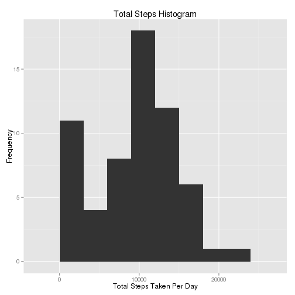
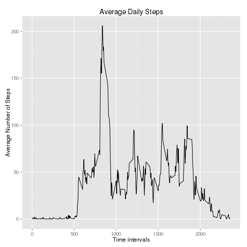
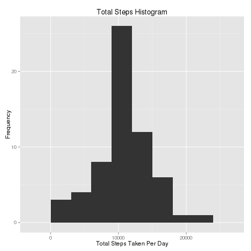
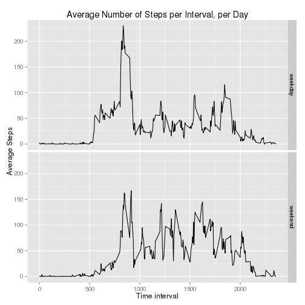

## Loading and preprocessing the data
Show any code that is needed to:

- Load the data (i.e. read.csv())
- Process/transform the data (if necessary) into a format suitable for your analysis

```r
# load additional libraries, suppress typical dplyr warning
library(dplyr,warn.conflicts = FALSE)
library(ggplot2)

# Clear environment
rm(list=ls())

# Assumes raw file exists in local directory
unzip(zipfile = "./activity.zip")

# read into main data frame
df<-read.csv(file = "./activity.csv")
```


## What is mean total number of steps taken per day?
For this part of the assignment, you can ignore the missing values in the dataset.

1. Make a histogram of the total number of steps taken each day

```r
# dplyr pipeline -> group by date and summarize sum per day
steps_by_day <- df %>% 
  group_by(date) %>%
  summarise(total_steps=sum(steps, na.rm = TRUE))

# Create Plot
g <- ggplot(steps_by_day)
g <- g+aes(steps_by_day$total_steps)
g <- g+geom_histogram(binwidth=3000)
g <- g+ggtitle(label = "Total Steps Histogram")
g <- g+xlab(label = "Total Steps Taken Per Day")
g <- g+ylab(label = "Frequency")
print(g)
```

 

2. Calculate and report the mean and median total number of steps taken per day

```r
# Simple mean and median answers
mean(steps_by_day$total_steps)
```

```
## [1] 9354.23
```

```r
median(steps_by_day$total_steps)
```

```
## [1] 10395
```


## What is the average daily activity pattern?
1. Make a time series plot (i.e. type = "l") of the 5-minute interval (x-axis) and the average number of steps taken, averaged across all days (y-axis)

```r
by_interval <- group_by(df,interval)
steps_avg_by_interval <- summarise(by_interval,avg=mean(steps,na.rm = TRUE))
g <- ggplot(steps_avg_by_interval)
g <- g+aes(interval,avg)
g <- g+geom_line()
g <- g+ggtitle(label = "Average Daily Steps")
g <- g+xlab(label = "Time intervals")
g <- g+ylab(label = "Average Number of Steps")
print (g)
```

 

2. Which 5-minute interval, on average across all the days in the dataset, contains the maximum number of steps?

```r
steps_avg_by_interval[which.max(steps_avg_by_interval$avg),1]
```

```
## Source: local data frame [1 x 1]
## 
##   interval
## 1      835
```


## Imputing missing values
Note that there are a number of days/intervals where there are missing values (coded as NA). The presence of missing days may introduce bias into some calculations or summaries of the data.

1. Calculate and report the total number of missing values in the dataset (i.e. the total number of rows with NAs)

```r
sum(is.na(df$steps))
```

```
## [1] 2304
```

2. Devise a strategy for filling in all of the missing values in the dataset. The strategy does not need to be sophisticated. For example, you could use the mean/median for that day, or the mean for that 5-minute interval, etc.

```r
# Strategy will be to use average of the 5-minute interval
```

3. Create a new dataset that is equal to the original dataset but with the missing data filled in.

```r
# df2 is new dataset with inserted averages
df2 <- mutate(df,steps = ifelse(is.na(steps),steps_avg_by_interval$avg,steps))
```

4. Make a histogram of the total number of steps taken each day and Calculate and report the mean and median total number of steps taken per day.


```r
# dplyr pipeline to group and summarize total steps per day
steps_by_day2 <- group_by(df2,date) %>% summarise(total_steps=sum(steps, na.rm = TRUE))

# Create Plot
g <- ggplot(steps_by_day2)
g <- g+aes(steps_by_day2$total_steps)
g <- g+geom_histogram(binwidth=3000)
g <- g+ggtitle(label = "Total Steps Histogram")
g <- g+xlab(label = "Total Steps Taken Per Day")
g <- g+ylab(label = "Frequency")
print(g)
```

 

```r
# Simple mean and median answers
mean(steps_by_day2$total_steps)
```

```
## [1] 10766.19
```

```r
median(steps_by_day2$total_steps)
```

```
## [1] 10766.19
```

Do these values differ from the estimates from the first part of the assignment? What is the impact of imputing missing data on the estimates of the total daily number of steps?

```r
# Yes, the values differ. Imputing missing values increases estimates of total numbers of steps.
```

## Are there differences in activity patterns between weekdays and weekends?
For this part the weekdays() function may be of some help here. Use the dataset with the filled-in missing values for this part.

1. Create a new factor variable in the dataset with two levels -- "weekday" and "weekend" indicating whether a given date is a weekday or weekend day.


```r
df2<-mutate(df2,day=as.factor(c("weekend",rep(x = "weekday",5),"weekend")[as.POSIXlt(date)$wday+1]))
```


2. Make a panel plot containing a time series plot (i.e. type = "l") of the 5-minute interval (x-axis) and the average number of steps taken, averaged across all weekday days or weekend days (y-axis). 

```r
new_df <- group_by(df2,interval,day) %>% summarise(avg=mean(steps))

g <- ggplot(new_df)
g <- g+aes(interval,avg)
g <- g+ geom_line()
g <- g+ facet_grid(day~.)
g <- g+ggtitle(label = "Average Number of Steps per Interval, per Day")
g <- g+xlab(label = "Time interval")
g <- g+ylab(label = "Average Steps")
print(g)
```

 
